Hands-on lab  
Feb 2021

<br />

**Contents**
- [GitHub リポジトリのフォーク](#GitHub-リポジトリのフォーク)

- [Web Apps の作成～アプリケーションの展開](#Azure-Web-Apps-の作成～アプリケーションの展開)

  - [リソース グループの作成](#リソース-グループの作成)

  - [Web Apps の作成](#Web-Apps-の作成)

  - [Web Apps の展開設定 (デプロイ センター)](#Web-Apps-の展開設定)

  - [GitHub Actions ワークフローの構成](#GitHub-Actions-ワークフローの構成)

- [Web アプリの更新～展開, KeyVault 参照の使用](#Web-アプリの更新～展開,-KeyVault-参照の使用)

  - リポジトリのクローン

    - [Visual Studio Code](#リポジトリの複製--Visual-Studio-Code)

    - [Visual Studio](#リポジトリの複製--Visual-Studio)

  - [ブランチの作成、Web アプリの更新～GitHub リポジトリへのプッシュ](#ブランチの作成、Web-アプリの更新～GitHub-リポジトリへのプッシュ)

    - ブランチの作成

      - [Visual Studio Code](#ブランチ作成--Visual-Studio-Code)

      - [Visual Studio](#ブランチ作成--Visual-Studio)

    - アプリケーションの更新

      - [Visual Studio Code](#アプリケーションの更新--Visual-Studio-Code)

      - [Visual Studio](#アプリケーションの更新--Visual-Studio)

    - リモート リポジトリへのプッシュ

      - [Visual Studio Code](#リモート-リポジトリへのプッシュ--Visual-Studio-Code)

      - [Visual Studio](#リモート-リポジトリへのプッシュ--Visual-Studio)

  - [Pull Request の作成、マージ～アプリケーションの展開](#Pull-Request-の作成、マージ～アプリケーションの展開)

  - [Web Apps の構成](#アプリケーション構成)

    - [アプリケーション設定の追加](#アプリケーション設定の追加)

    - [KeyVault の作成](#KeyVault-の作成)

    - [シークレットの追加](#シークレットの追加)

    - [マネージド ID の作成](#マネージド-ID-の作成)

    - [アクセス ポリシーの設定](#アクセス-ポリシーの設定)

    - [KeyVault 参照の構成](#KeyVault-参照の構成)

<br />

# **要約および学習目標**

### **事前準備**

- ローカル環境
  - Visual Studio または Visual Studio Code のインストール

    Visual Studio 2019  
    <https://visualstudio.microsoft.com/ja/downloads/>  
    ※バージョンは 16.8 以降

    Visual Studio Code  
    <https://azure.microsoft.com/ja-jp/products/visual-studio-code/>

    - 拡張機能：C# for Visual Studio Code  
      <https://marketplace.visualstudio.com/items?itemName=ms-dotnettools.csharp>

  - Git のインストール  
    <https://git-scm.com/>

  - Azure CLI のインストール  
    <https://docs.microsoft.com/ja-jp/cli/azure/install-azure-cli>

- GitHub

  - アカウントの作成  
    <https://github.com/>

- Microsoft Azure

  - ポータルへのアクセス  
    <https://portal.azure.com/>

<br />

# **GitHub リポジトリのフォーク**

- Web ブラウザを起動し、ワークショップのリポジトリを表示  
  <https://github.com/hiroyay-ms/Git-Training-for-Beginner>
- 画面右上の **fork** をクリック

  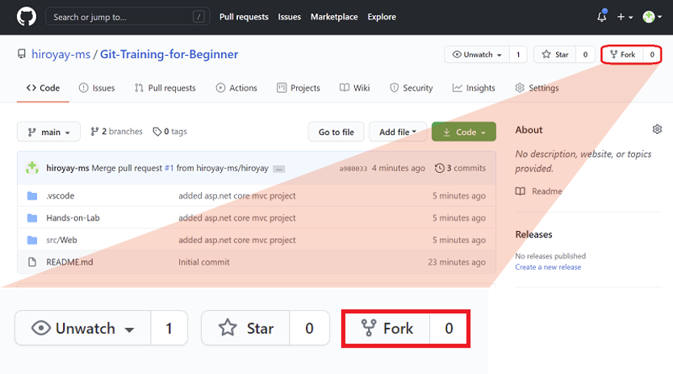

- リポジトリが複製されていることを確認

  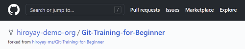

  ※ hiroyay-demo-org の箇所に自身の github アカウント名が表示されていることを確認

<br />

# **Azure Web Apps の作成～アプリケーションの展開**

## リソース グループの作成

- Web ブラウザを起動し **[Azure ポータル](https://portal.azure.com)** を表示

- 画面上部の "**＋リソースの作成**" をクリック

  

- 検索ボックスに **Resource Group** と入力  
    表示される候補より **Resource Group** を選択

  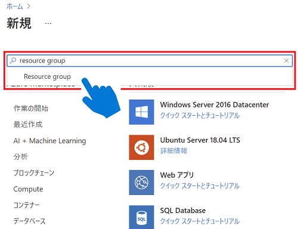

- "**作成**" をクリック

  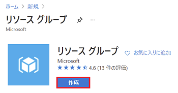

- **リソース グループ名** を入力し, **リージョン** を選択  
  "**確認および作成**" をクリック

  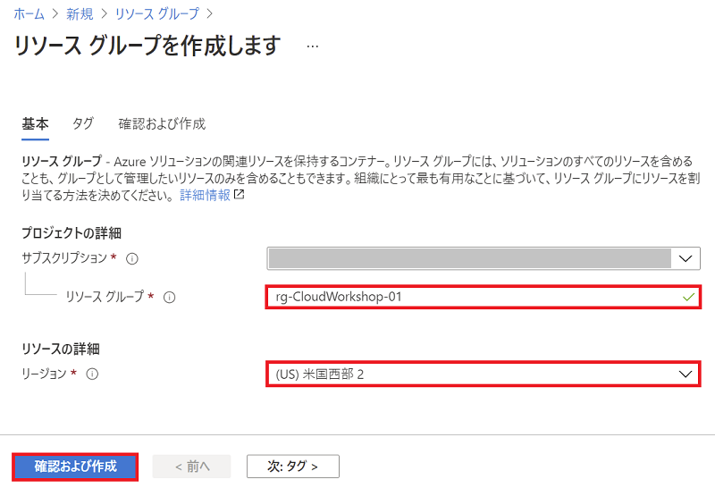  
  ※リソース グループ名、リージョンは任意

- 入力内容に不備がないことを確認し "**作成**" をクリック

  

- リソース グループの作成を確認

  

## Web Apps の作成

- **[Azure ポータル](https://portal.azure.com)** のホーム画面を表示

- 画面上部の "**＋リソースの作成**" をクリック

  

- **Web アプリ** を選択

  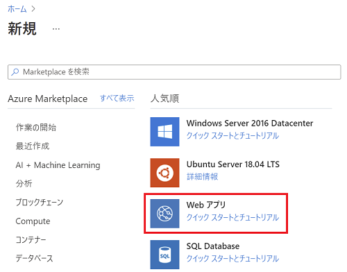

- **Web アプリの作成**  
  **基本** タブ
  - **リソース グループ**: 先の手順で作成したものを選択
  - **名前**: （任意）※インターネットに公開できるユニークな名前
  - **公開**: コード
  - **ランタイム スタック**: .NET Core 3.1 (LTS)
  - **オペレーティング システム**: Windows
  - **地域**: （任意）
  - **App Service プラン**: （新規作成）名前は任意
  - **SKU とサイズ**: Premium V3 P1V3

    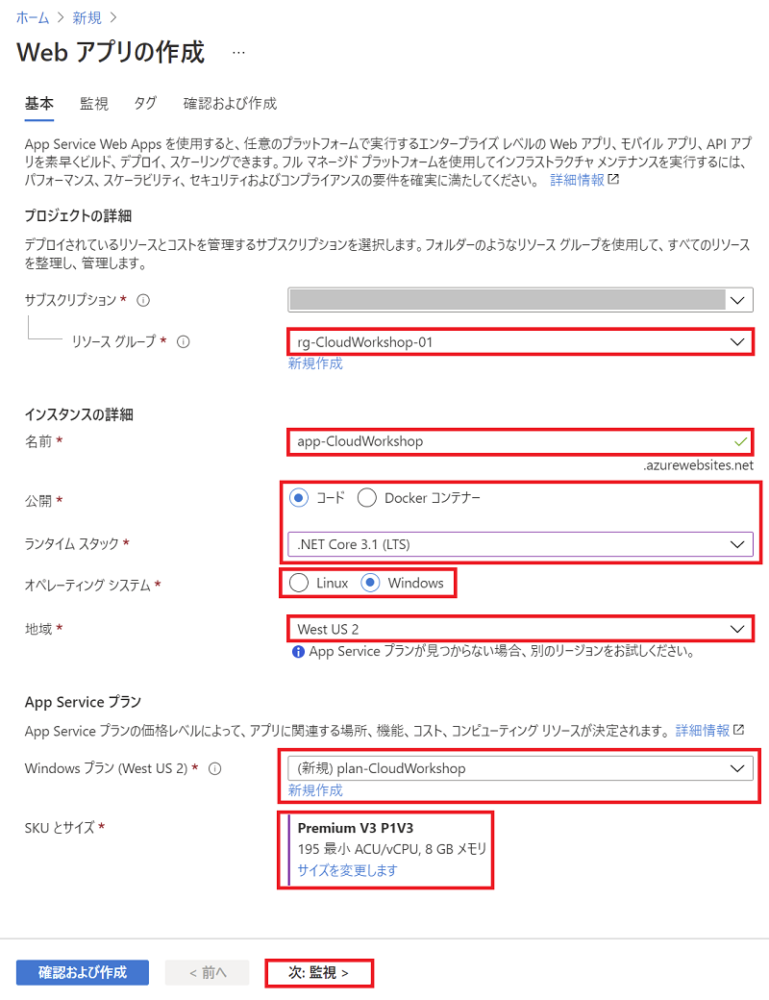  

    ※App Service プランは新規作成をクリックし、名前を入力  
    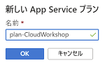

    ※SKU とサイズは **サイズを変更します** をクリックし P1V3 を選択  
    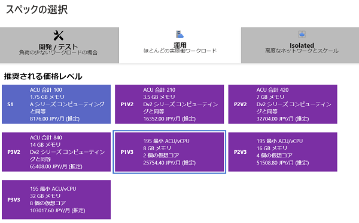

    必要事項を入力、選択後 "**次: 監視** をクリック

  **監視** タブ
  - **Applicatoin Insights を有効にする**: いいえ

    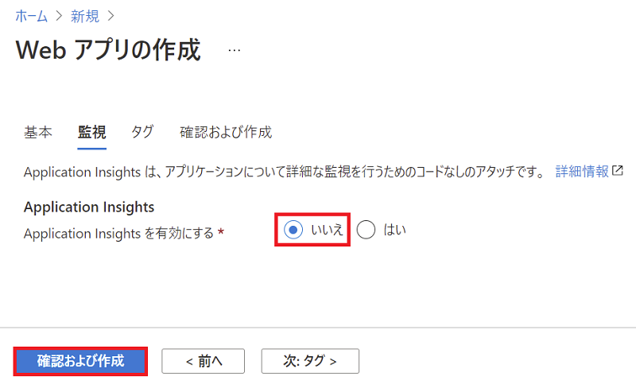

    ※"**確認および作成**" をクリック

  **確認および作成** タブ

  - 入力内容に誤りがないことを確認し "**作成**" をクリック

    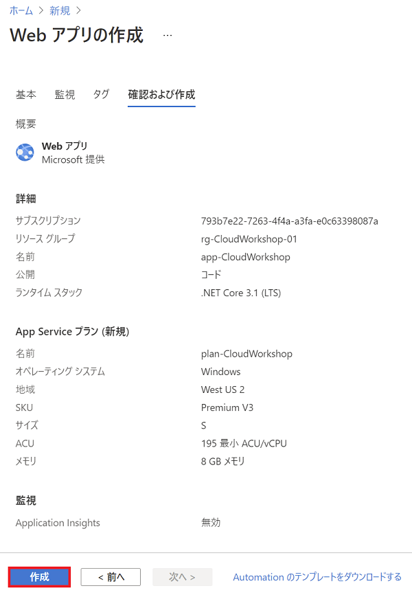

- リソースの展開が正常に完了したことを確認し、"**リソースへ移動**" をクリック

  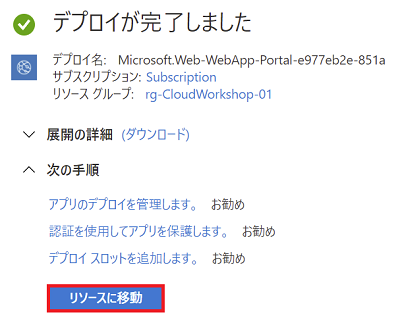

## Web Apps の展開設定

- Web Apps の管理ブレードを表示  
  左側のメニューから "**デプロイ センター**" をクリック

  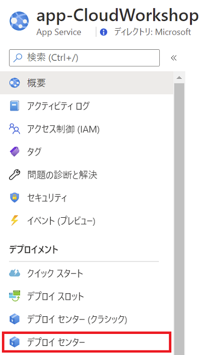

- "**設定**" をクリック

  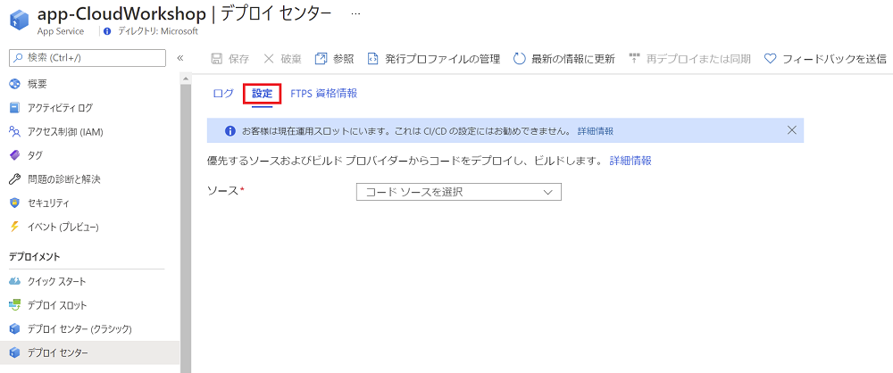

- ソースから"**GitHub**" を選択し、"**承認する**" をクリック

  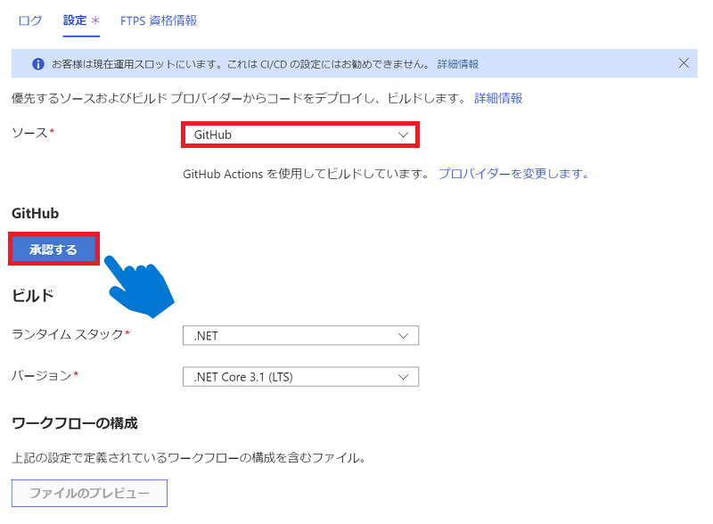

- GitHub アカウント名とパスワードを入力し、"**Sign in**" をクリック

  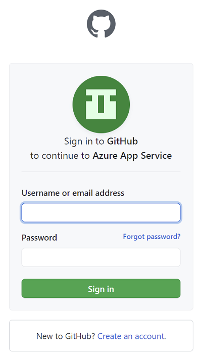

- GitHub リポジトリ、ブランチを選択
  - **組織**: GitHub アカウント名
  - **リポジトリ**: fork したリポジトリ名 (Git-Training-for-Beginner)
  - **ブランチ**: main

  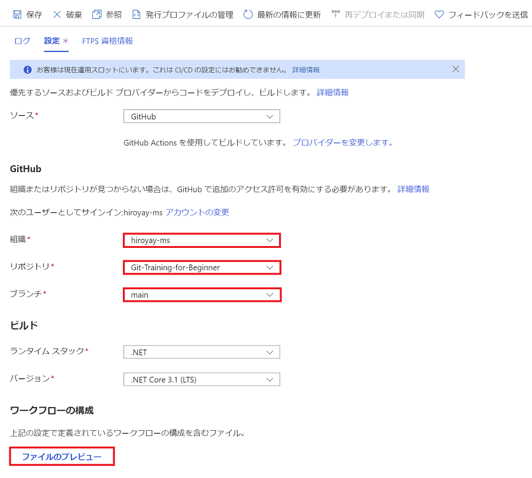

- "**ファイルのプレビュー**" をクリック  
  ※GitHub から Azure Web Apps へアプリケーションを展開するワークフローの内容を確認

  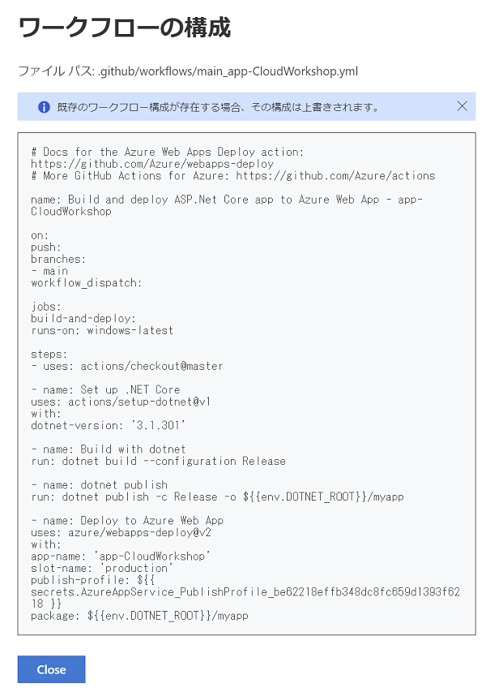

  内容を確認後 "**Close**" をクリックし、プレビュー画面を閉じる

- "**保存**" をクリックし変更内容を反映  
  ※GitHub のシークレットに発行プロファイルを登録  
  ※GitHub Actions のワークフローを作成

  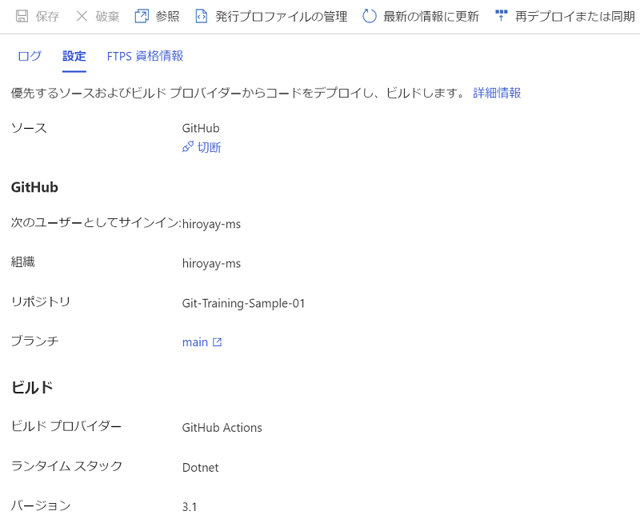

## GitHub Actions ワークフローの構成

- リポジトリを表示  
  "**Settings**" をクリック

  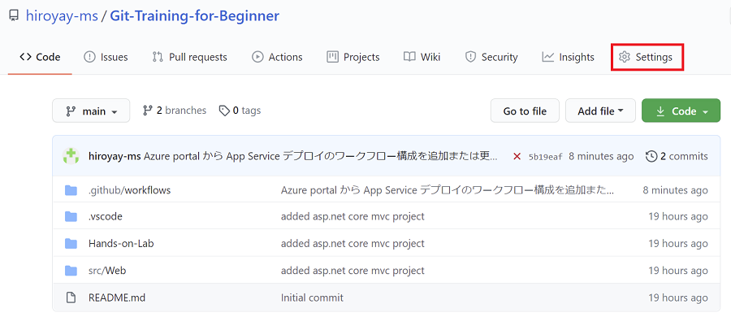

- "**Secrets**" をクリック  
  ※Repository secrets に発行プロファイル情報が登録されていることを確認

  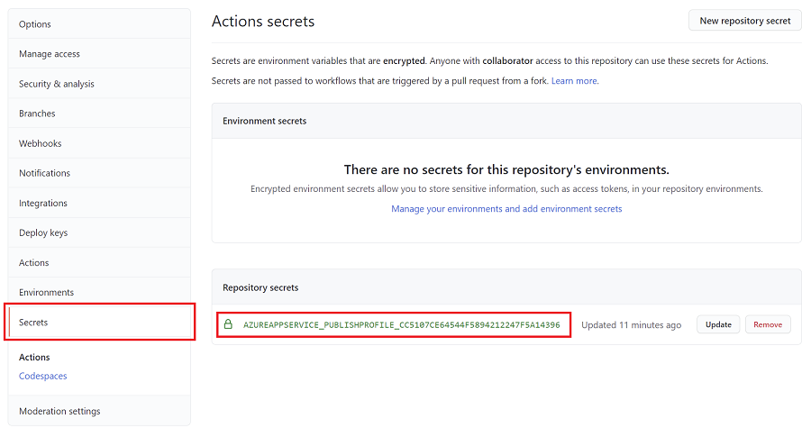

- "**Code**" をクリック  
  **.github/workflows** へ移動し main_app_XXXX.yml を選択  
  ※ファイル名は作成した Web Apps の名前により異なります。

  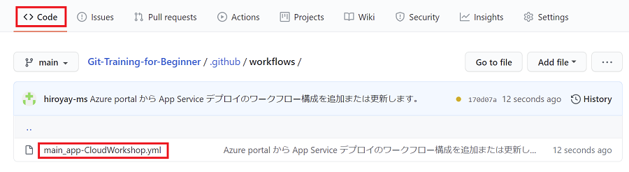

- 鉛筆マークのアイコンをクリック

  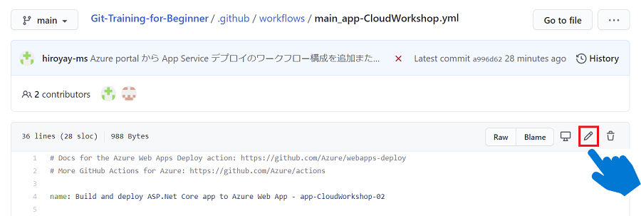

- Editor が起動し、ワークフロー ファイル (.yml) の内容が表示

  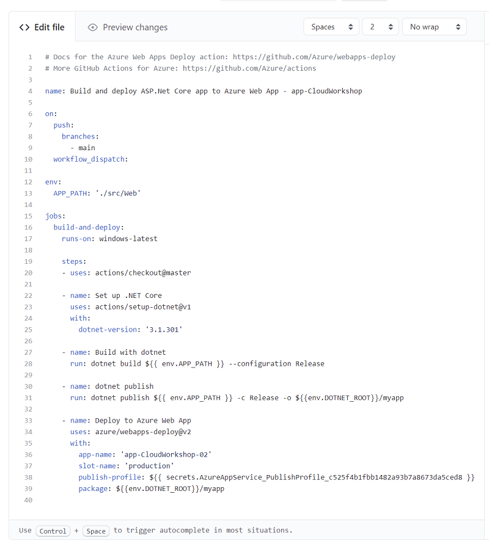

- 11 行目を改行し、以下のコードを挿入

  ```
  env:
    APP_PATH: './src/Web'
  ```
  ※ASP.NET Core MVC のプロジェクト ファイルへのパスを追加

- dotnet build コマンドを以下に変更

   ```
   dotnet build ${{ env.APP_PATH }} --configuration Release
   ```
   ※追加した変数を build の後に追加

- dotnet publish コマンドを以下に変更

  ```
  dotnet publish ${{ env.APP_PATH }} -c Release -o ${{env.DOTNET_ROOT}}/myapp
  ```
  ※追加した変数を publish の後に追加

  <br />

  ※変更後のワークフロー ファイル（全文）
  ```
  name: Build and deploy ASP.Net Core app to Azure Web App - app-CloudWorkshop

  on:
    push:
      branches:
        - main
    workflow_dispatch:

  env:
    APP_PATH: './src/Web'

  jobs:
    build-and-deploy:
      runs-on: windows-latest

      steps:
      - uses: actions/checkout@master

      - name: Set up .NET Core
        uses: actions/setup-dotnet@v1
        with:
          dotnet-version: '3.1.301'

      - name: Build with dotnet
        run: dotnet build ${{ env.APP_PATH }} --configuration Release

      - name: dotnet publish
        run: dotnet publish ${{ env.APP_PATH }} -c Release -o ${{env.DOTNET_ROOT}}/myapp

      - name: Deploy to Azure Web App
        uses: azure/webapps-deploy@v2
        with:
          app-name: 'app-CloudWorkshop'
          slot-name: 'production'
          publish-profile: ${{ secrets.AzureAppService_PublishProfile_ここの値は環境によって変わります }}
          package: ${{env.DOTNET_ROOT}}/myapp
   ```

- "**Start commit**" をクリック  
  "**Commit changes**" をクリックし、変更を反映

  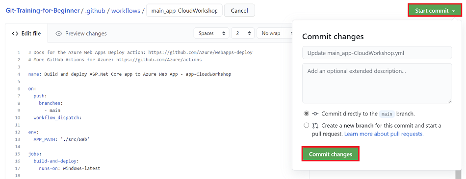

- "**Actions**" タブをクリック

  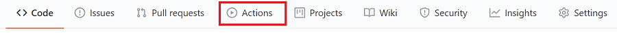

- 起動しているワークフローを選択  
  ※ワークフローが push イベントをトリガーに起動するため、.yml ファイル保存時にワークフローが起動

  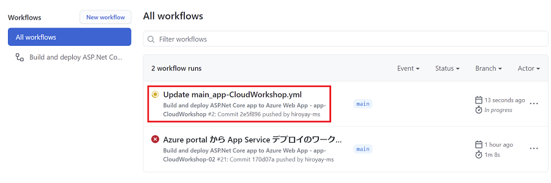

- ワークフローの実行状況を確認

  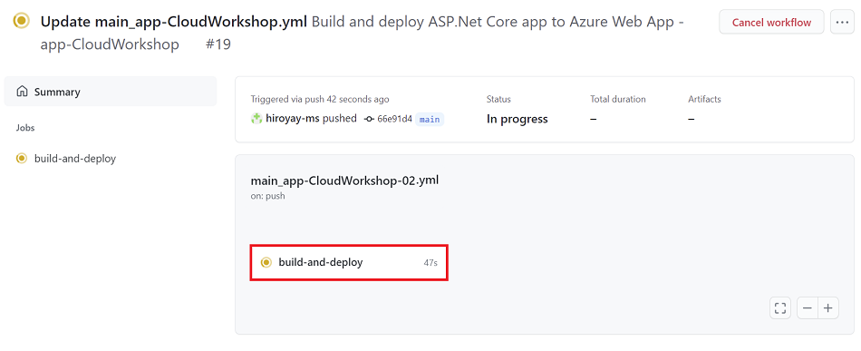

  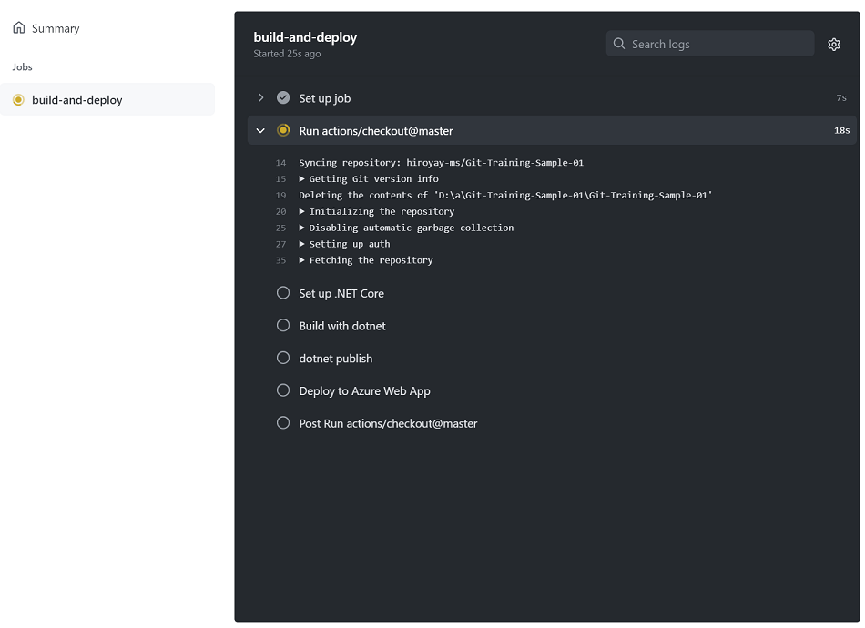

- 正常に終了することを確認

  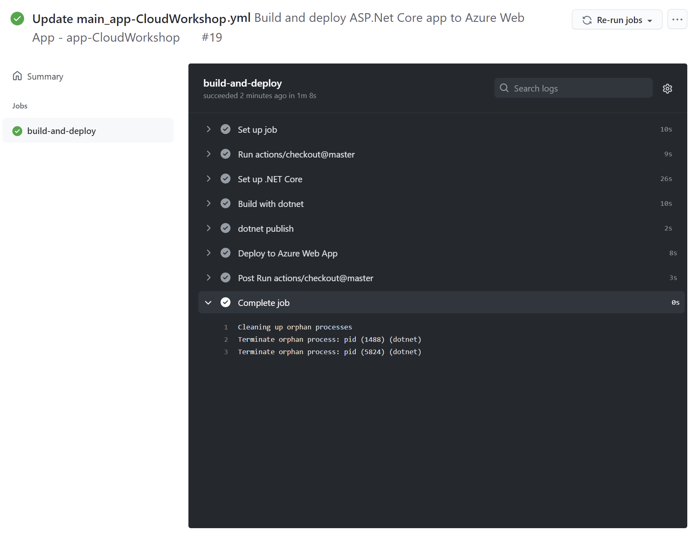

- [**Azure ポータル**](https://portal.azure.com) を表示し、Web Apps の管理ブレードから "**概要**" を選択  
  "**URL**" をクリックし、新しいタブでアプリケーションを表示

  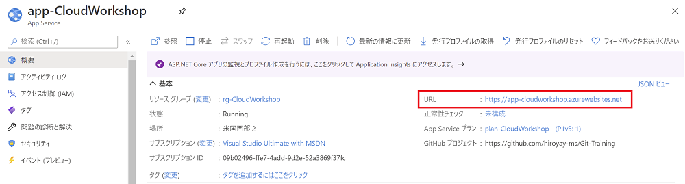

<br />

### **参考情報**
- [**Azure リソースの名前付けおよびタグ付けの戦略を作成する**](https://docs.microsoft.com/ja-jp/azure/cloud-adoption-framework/ready/azure-best-practices/naming-and-tagging)

- [**名前付け規則を定義する**](https://docs.microsoft.com/ja-jp/azure/cloud-adoption-framework/ready/azure-best-practices/resource-naming)

- [**Azure リソースの種類に推奨される省略形**](https://docs.microsoft.com/ja-jp/azure/cloud-adoption-framework/ready/azure-best-practices/resource-abbreviations)  

- [**GitHub Actions -ワークフローをトリガーするイベント**](https://docs.github.com/ja/actions/reference/events-that-trigger-workflows)

- [**GitHub Actions -Azure App Service へのデプロイ**](https://docs.github.com/ja/actions/guides/deploying-to-azure-app-service)

- [**GitHub Actions -.NET でのビルドとテスト**](https://docs.github.com/ja/actions/guides/building-and-testing-net)

<br />

# Web アプリの更新～展開, KeyVault 参照の使用

## リポジトリのクローン

### リポジトリの複製 -Visual Studio Code

※[Visual Studio をご利用の場合はこちら](#リポジトリの複製--Visual-Studio)

- Web ブラウザを起動し、GitHub リポジトリを表示  
  "**Code**" をクリックし URL をコピー

  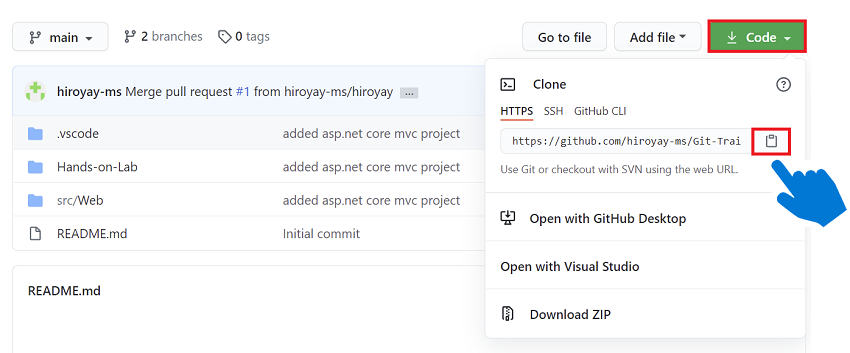

- Visual Studio Code を起動  
  画面左上のアイコンをクリックし Explorer を表示

  

- "**Clone Repository**" をクリック

  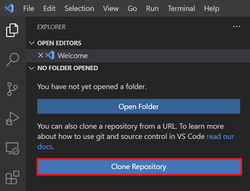

- 画面上部に表示されるコマンド パレットにコピーした URL を貼り付け Enter キーを押下

  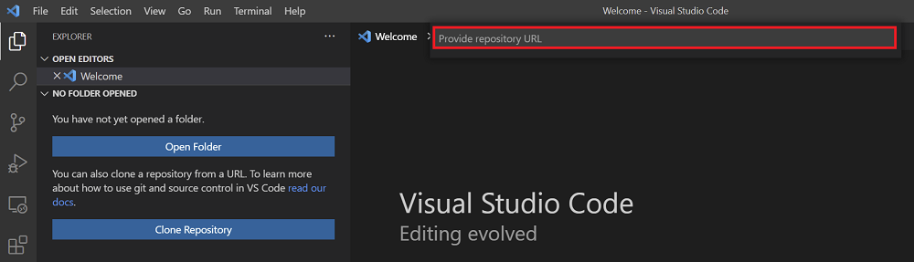
  
- エクスプローラーでリポジトリの複製先となるフォルダを選択（任意）  
  "**Select Repository Location**" をクリック

  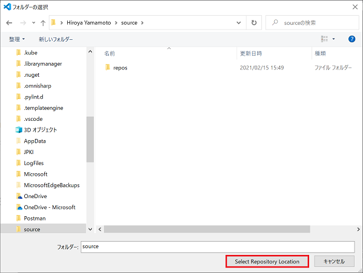

- 複製完了後、画面下部にメッセージが表示  
  "**Open**" をクリック

  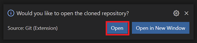

- "**src/Web**" に Web アプリケーションのソース コードが複製されていることを確認

  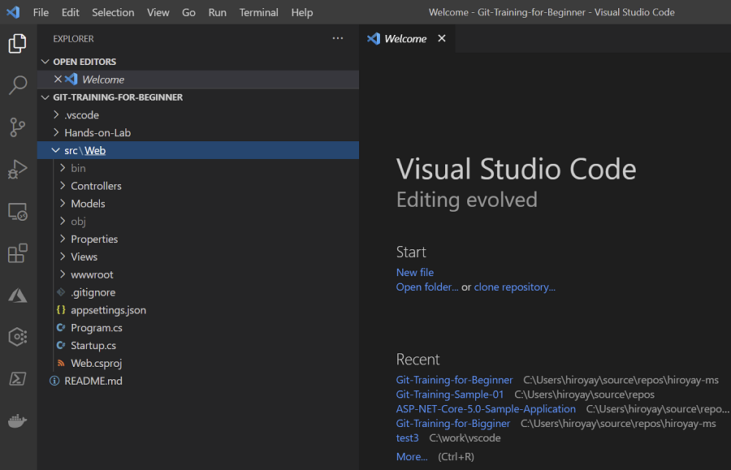

- "**F5**" キーを押下、または "**Run**" - "**Start**" をクリックし、アプリケーションをデバッグ実行

  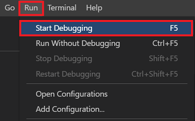

- ブラウザを起動し、アプリケーションを表示  
  ※https://localhost:5001

  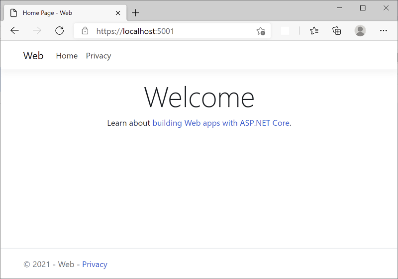

<br />

[次の手順: ブランチの作成](#ブランチ作成--Visual-Studio-Code)

<br />

### リポジトリの複製 -Visual Studio

- Visual Studio を起動  
  "**リポジトリのクローン**" を選択

  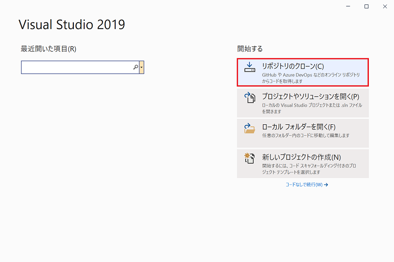

- "**GitHub**" をクリック

  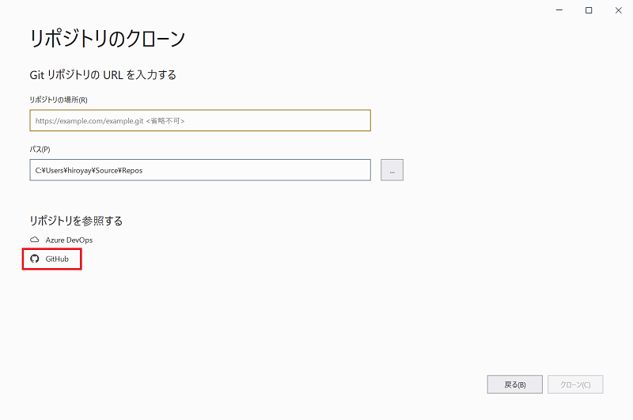

- "**ブラウザーでサインインします**" をクリック

  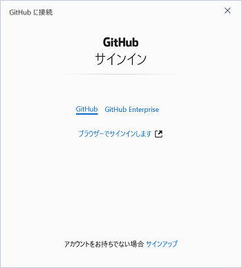

  ※Web ブラウザーでサインインを実行  
  ※すでに GitHub にサインインしている場合はプロファイル ページが表示

- クローンするリポジトリを選択し "**複製**" をクリック

  

- ソリューション エクスプローラーにてコードが複製されたことを確認

  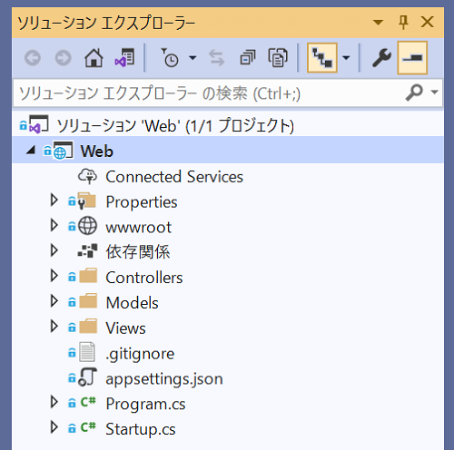

  ※フォルダ ビューの場合は、Web.sln ファイルをダブルクリックしプロジェクトを読み込み

- "**F5**" キーを押下、または "**デバッグ**" - "**デバッグの開始**" を実行

  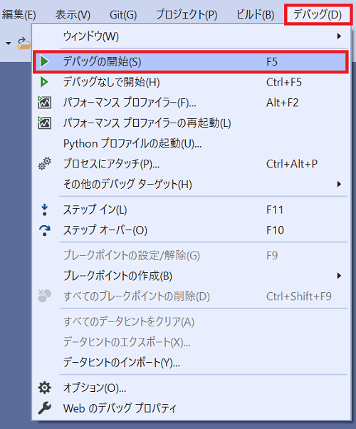

- ブラウザが起動し、アプリケーションが表示されることを確認

  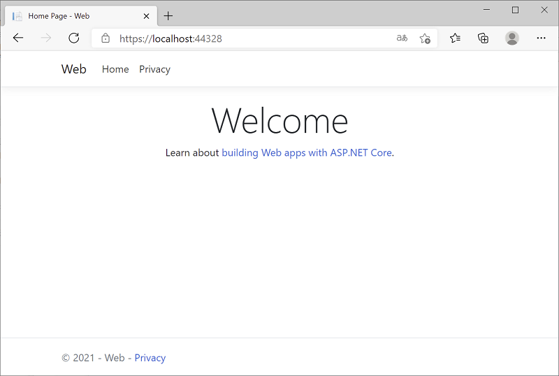

<br />

[次の手順: ブランチの作成](#ブランチ作成--Visual-Studio)

<br />

## ブランチの作成、Web アプリの更新～GitHub リポジトリへのプッシュ

### ブランチ作成 -Visual Studio Code

- 画面左下の "**main**" をクリック

  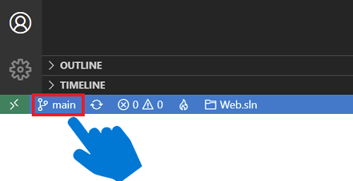

- 画面上部のコマンド パレットにて "**+ Create new branch...**" を選択

  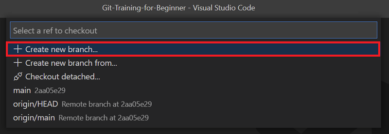

- Branch name (任意) を入力

  

- 画面左下のブランチ名が入力した名前に変更されていることを確認

  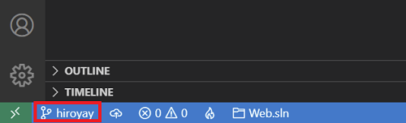

<br />

[次の手順: アプリケーションの更新](#アプリケーションの更新--Visual-Studio-Code)

<br />

### ブランチ作成 -Visual Studio

- 画面右下のブランチ名をクリックし、"**新しいブランチ**" を選択

  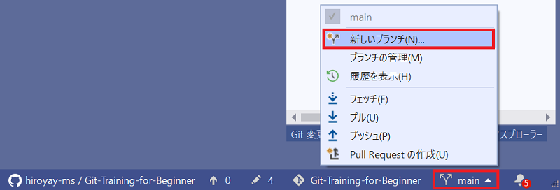

- ブランチ名 (任意) を入力し、"**作成**" をクリック

  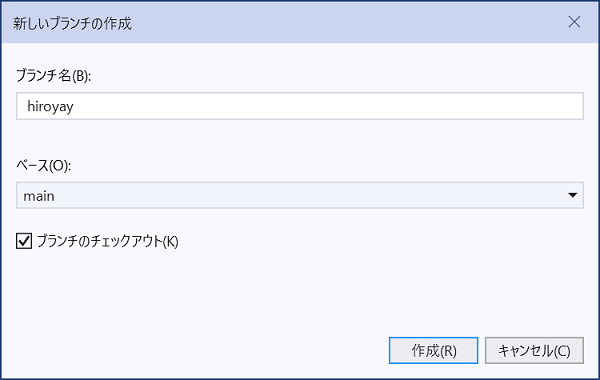

- 画面右下のブランチ名が入力した名前に変更されていることを確認

  

<br />

[次の手順: アプリケーションの更新](#アプリケーションの更新--Visual-Studio)

<br />

### アプリケーションの更新 -Visual Studio Code

- エクスプローラーで "**Web**" を右クリックし "**New File**" を選択

  

- "appsettings.Development.json" ファイルを追加

  

- appsettings.Development.json ファイルをエディタで開き、以下の内容に変更

  ```
  {
    "MyKey": "Hello World"
  }
  ```

  ※キーの値は任意で設定可

- "**Controllers**" - "**HomeController.cs**" を選択

    
  ※エディタでファイルが開く

- 26, 27 行目のコメントを解除

  

- "**Views**" - "**Home**" - "**Index.cshtml**" を選択  
  ※エディタでファイルが開く

  

- 10, 16 行目のコメントを解除

  

- "**HomeController.cs**" の 26 行目にブレーク ポイントを設定

  

- "**F5**" キーを押下、または "**Run**" - "**Start Debugging**" をクリックし、アプリケーションのデバッグ実行を開始

  ※Web ブラウザを起動し "**https://localhost:5001**" へアクセス

  ※設定したブレーク ポイントで停止

  

  ※F10 キーを押下し、ステップ実行  

    
  ※myKeyValue に appsettings.Development.json に設定した値が格納されていることを確認

  ※F5 キーを押下しデバッグ実行を続行

  ※アプリケーションが表示

  

- デバッグ実行を停止

  

<br />

[次の手順: リモート リポジトリへのプッシュ](#リモート-リポジトリへのプッシュ--Visual-Studio-Code)

<br />
    
### アプリケーションの更新 -Visual Studio

- Web プロジェクトを右クリック  
  "**追加**" - "**新しい項目**" を選択

  

- "**JSON ファイル**" を選択  
  名前に "**appsettings.Development.json**" と入力し "**追加**" をクリック

  

- appsettings.Development.json ファイルをエディタで開き、以下の内容に変更

  ```
  {
    "MyKey": "Hello World"
  }
  ```

  ※キーの値は任意で設定可

- ソリューション エクスプローラーで "**Controllers**" - "**HomeControllers.cs**" を選択
  ※エディタでファイルが開く

  

- 26, 27 行目のコメントを解除

  

- ソリューション エクスプローラーで "**Views**" - "**Home**" - "**Index.cshtml**" を選択  
  ※エディタでファイルが開く

  

- 10, 16 行目のコメントを解除

  

- "**HomeController.cs**" の 26 行目にブレーク ポイントを設定

  

- "**F5**" キーを押下、または "**デバッグ**" - "**デバッグの開始**" を実行

  ※Web ブラウザが起動

  ※設定したブレーク ポイントで停止

  

  ※F10 キーを押下し、ステップ実行  

    
  ※myKeyValue に appsettings.Development.json に設定した値が格納されていることを確認

  ※F5 キーを押下しデバッグ実行を続行

  ※アプリケーションが表示

  
  
  ※Web ブラウザを閉じ、デバッグ実行を停止

<br />

[次の手順: リモート リポジトリへのプッシュ](#リモート-リポジトリへのプッシュ--Visual-Studio)

<br />

### リモート リポジトリへのプッシュ -Visual Studio Code

- 画面左のアイコンをクリックし "**Source Control**" へ移動  
  メッセージを入力し、"**✓**" をクリックしローカル リポジトリへコミットを実行

  

- "**...**" アイコンをクリックし "**Push**" を選択

  

  ※メッセージが表示される場合 "**OK**" をクリック

  

<br />

[次の手順へ](#Pull-Request-の作成、マージ～アプリケーションの展開)

<br />

### リモート リポジトリへのプッシュ -Visual Studio

- "**表示**" - "**Git 変更**" をクリック

  

- メッセージを入力し "**すべてをコミット**" をクリックし、ローカル リポジトリへコミット 

  

- "↑" アイコンをクリックし、リモート リポジトリへプッシュ

  

- 正常にプッシュされたことを確認

  

<br />

[次の手順へ](#Pull-Request-の作成、マージ～アプリケーションの展開)

<br />

## Pull Request の作成、マージ～アプリケーションの展開

- 自身の GitHub アカウントの fork したリポジトリを表示

- "**Compare & pull request**" をクリック 

  

  ※メッセージが表示されていない場合は、"**Pull requests**" タブから "**New pull request**" をクリック

  

- "Create pull request" をクリック

  

- "Merge pull request" をクリック

  

- "Confirm merge" をクリック

  

- ステータスが Merged となり、変更が main ブランチに反映されたことを確認

  

- "**Actions**" タブへ移動し、ワークフローの起動を確認  
  ※承認操作によりソース コードの変更が main ブランチに Push されたため、ワークフローが起動

  

- ワークフローが正常に完了することを確認

  

<br />

## アプリケーション構成

### アプリケーション設定の追加

- [Azure ポータル](https://portal.azure.com) へ移動

- Web Apps の管理ブレードを表示

- 左側のメニューより "**構成**" をクリック  
  "**＋ 新しいアプリケーション設定**" をクリック

  

- アプリケーション設定の追加/編集画面が開くので、以下の項目を入力し "**OK**" をクリック

  - **名前**: MyKey
  - "**値**": Hello World (任意)

    

- 設定がつい枯れていることを確認し "**保存**" をクリック  

    

- メッセージが表示されるので "**続行**" をクリック

  


  ※設定が適用され、アプリケーションを再起動

- "**概要**" タブへ移動

  

- アプリケーション設定に追加した値が画面上に表示されることを確認

  

<br />

### KeyVault の作成

- [Azure ポータル](https://portal.azure.com) のトップ ページへ移動

- "**＋リソースの作成**" をクリック

  

- 新規リソース作成の画面が表示  
  検索ボックスに "**key vault**" と入力し、表示される候補より "**Key Vault**" を選択

  

- "**作成**" をクリック

  

- キー コンテナーの作成  
"**基本**" タブ

  - **リソース グループ**: 今回使用するリソース グループを選択

  - **Key Vault 名**: (任意)

    ※あとの項目は既定のまま、"**確認および作成**" をクリック

    

- 入力内容に不備がないことを確認し "**作成**" をクリック

  

- デプロイ完了後 "**リソースに移動**" をクリック

  

<br />

### シークレットの追加

- KeyVault の管理ブレードを表示  
  左側のメニューから "**シークレット**" をクリック

  

- "**＋生成/インポート**" をクリック

  

- シークレットの作成  
  必要項目の入力を行い "**作成**" をクリック

  - アップロード オプション: 手動 (既定)
  - **名前**: (任意)
  - **値**: (任意)　※KeyVault シークレットからの取得と分かるようアプリケーション設定に指定した値と変えること
  - コンテンツの種類: (既定)
  - アクティブ化する日の設定: オフ (既定)
  - 有効期限の設定: オフ (既定)
  - 有効ですか： はい (既定)

  

- シークレットの追加を確認

  

<br />

### マネージド ID の作成

- Web Apps の管理ブレードへ移動  
  左側のメニューから "**ID**" をクリック

  

- "**状態**" を "**オン**" に変更し "**保存**" をクリック

  

- システム割り当てマネージド ID を有効にするか確認のメッセージが表示されるので "**はい**" をクリック

  

- 作成後の画面で "**オブジェクト ID**" をコピー

  

<br />

### アクセス ポリシーの設定

- KeyVault の管理ブレードへ移動  
  左側のメニューから "**アクセス ポリシー**" をクリック

  

- "**＋アクセス ポリシーの追加**" をクリック

  

- アクセス ポリシーの追加

  - "**シークレットのアクセス許可**" をクリック

    

    ※**取得** にチェック

    

    ※**プリンシパルの選択** の "**選択されていません**" をクリック

    

  - プリンシパルの選択画面で先の手順でコピーした **オブジェクト ID** を貼り付け

    ※検索結果に表示される項目 (Web Apps の名前のオブジェクト) をクリック

    ※選択したアイテムにサービス プリンシパルが表示されたことを確認し "**選択**" をクリック

    

  - **シークレットのアクセス許可**、**プリンシパルの選択**に指定した項目が反映されていることを確認  
    "**追加**" をクリック

    

- **アプリケーション** に Web Apps が表示されていることを確認し "**保存**" をクリック

  

<br />

### KeyVault 参照の構成

- KeyVault の管理ブレードの画面左側のメニューから "**シークレット**" を選択  
  先の手順で登録したシークレットをクリック

  

- 現在のバージョンに表示される文字列をクリック

  

- シークレット識別子をコピー  
  ※後の手順で使用するためメモ帳などに貼り付け

  

- Web Apps の管理ブレードへ移動  
  画面左側のメニューから "**構成**" をクリック

  

- 先の手順で登録したアプリケーション設定の編集列のアイコンをクリック

  

- 値を変更し "**OK**" をクリック

  

  ```
  @Microsoft.KeyVault(SecretUri=シークレット識別子)
  ```
  ※シークレット識別子をコピーしたシークレット識別子に置き換え

  以下の指定でも OK

  ```
  @Microsoft.KeyVault(VaultName=キー コンテナ名;SecretName=シークレット名)
  ```

- "**保存**" をクリック

  

- アプリケーションの再起動を求めるメッセージが表示されるので "**続行**" をクリック

  

- 設定反映後、アプリケーション設定が KeyVault を参照していることを確認

  

- "**概要**" タブへ移動  
  **URL** をクリックし、新しいタブでアプリケーションを表示

  

- KeyVault に登録したシークレットから値を取得していることを確認

  

<br />

### **参考情報**

- [**App Service と Azure Functions の KeyVault 参照を使用する**](https://docs.microsoft.com/ja-jp/azure/app-service/app-service-key-vault-references)

<br />

---

Information in this document, including URL and other Internet Web site references, is subject to change without notice. Unless otherwise noted, the example companies, organizations, products, domain names, e-mail addresses, logos, people, places, and events depicted herein are fictitious, and no association with any real company, organization, product, domain name, e-mail address, logo, person, place or event is intended or should be inferred. Complying with all applicable copyright laws is the responsibility of the user. Without limiting the rights under copyright, no part of this document may be reproduced, stored in or introduced into a retrieval system, or transmitted in any form or by any means (electronic, mechanical, photocopying, recording, or otherwise), or for any purpose, without the express written permission of Microsoft Corporation.

Microsoft may have patents, patent applications, trademarks, copyrights, or other intellectual property rights covering subject matter in this document. Except as expressly provided in any written license agreement from Microsoft, the furnishing of this document does not give you any license to these patents, trademarks, copyrights, or other intellectual property.

The names of manufacturers, products, or URLs are provided for informational purposes only and Microsoft makes no representations and warranties, either expressed, implied, or statutory, regarding these manufacturers or the use of the products with any Microsoft technologies. The inclusion of a manufacturer or product does not imply endorsement of Microsoft of the manufacturer or product. Links may be provided to third party sites. Such sites are not under the control of Microsoft and Microsoft is not responsible for the contents of any linked site or any link contained in a linked site, or any changes or updates to such sites. Microsoft is not responsible for webcasting or any other form of transmission received from any linked site. Microsoft is providing these links to you only as a convenience, and the inclusion of any link does not imply endorsement of Microsoft of the site or the products contained therein.

© 2021 Microsoft Corporation. All rights reserved.